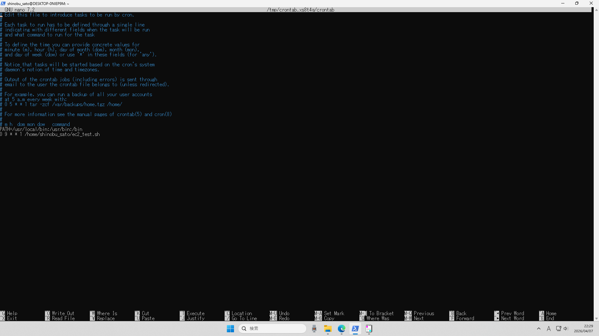
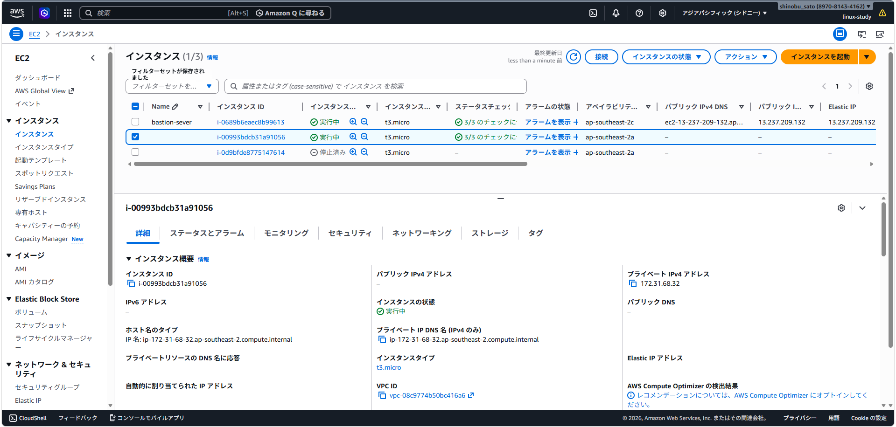
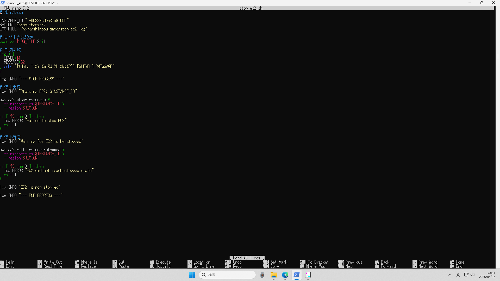
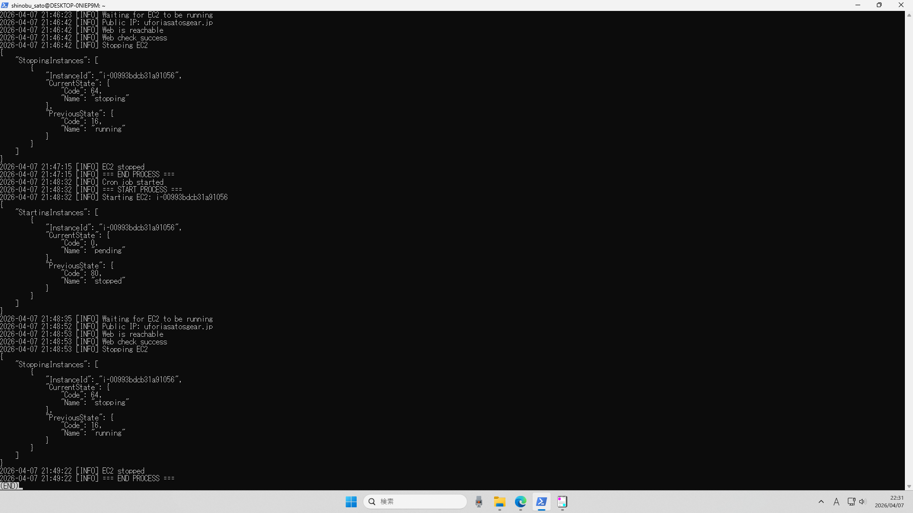

# EC2自動化ポートフォリオ

## 概要
EC2の起動、Web確認、ログ取得、停止までをスクリプト化し、cronで自動実行するようにしました。

## 構成図
[cron]  
　↓  
[Shell Script]  
　↓  
[AWS CLI]  
　↓  
[EC2]  

## スクリプト処理フロー
1. EC2起動
2. 起動待機
3. Web疎通確認
4. ログ取得
5. EC2停止

## スクリーンショット
- cron設定

- ec2_start.sh

- ec2_stop.sh

- start,stopのログ

## 工夫ポイント
- 再試行処理（リトライ）
- ログフォーマット統一
- 踏み台サーバー経由のscp対応
- セキュリティ（鍵管理・.gitignore）
- Slack連動
- log rotateに対応

## 今後の課題
- systemd timer版の自動実行
- AWS Systems Managerによる踏み台無し構成
- ログをS3に送る
